# Домашнее задание к занятию 5. «Практическое применение Docker»

### Инструкция к выполнению

1. Для выполнения заданий обязательно ознакомьтесь с [инструкцией](https://github.com/netology-code/devops-materials/blob/master/cloudwork.MD) по экономии облачных ресурсов. Это нужно, чтобы не расходовать средства, полученные в результате использования промокода.
3. **Своё решение к задачам оформите в вашем GitHub репозитории.**
4. В личном кабинете отправьте на проверку ссылку на .md-файл в вашем репозитории.
5. Сопроводите ответ необходимыми скриншотами.

---
## Примечание: Ознакомьтесь со схемой виртуального стенда [по ссылке](https://github.com/netology-code/shvirtd-example-python/blob/main/schema.pdf)

---

## Задача 0
1. Убедитесь что у вас НЕ(!) установлен ```docker-compose```, для этого получите следующую ошибку от команды ```docker-compose --version```
```
Command 'docker-compose' not found, but can be installed with:

sudo snap install docker          # version 24.0.5, or
sudo apt  install docker-compose  # version 1.25.0-1

See 'snap info docker' for additional versions.
```
В случае наличия установленного в системе ```docker-compose``` - удалите его.  
2. Убедитесь что у вас УСТАНОВЛЕН ```docker compose```(без тире) версии не менее v2.24.X, для это выполните команду ```docker compose version```  
###  **Своё решение к задачам оформите в вашем GitHub репозитории!!!!!!!!!!!!!!!!!!!!!!!!!!!!!!!!**

<span style="color:red"> 

## Ответ  
<span style="color:black">

Скриншоты.  

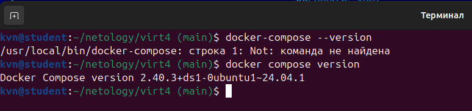  

---

## Задача 1
1. Сделайте в своем GitHub пространстве fork [репозитория](https://github.com/netology-code/shvirtd-example-python).

2. Создайте файл ```Dockerfile.python``` на основе существующего `Dockerfile`:
   - Используйте базовый образ ```python:3.12-slim```
   - Обязательно используйте конструкцию ```COPY . .``` в Dockerfile
   - Создайте `.dockerignore` файл для исключения ненужных файлов
   - Используйте ```CMD ["uvicorn", "main:app", "--host", "0.0.0.0", "--port", "5000"]``` для запуска
   - Протестируйте корректность сборки
2.1 Используйте multistage сборку вместо single stage.
3. (Необязательная часть, *) Изучите инструкцию в проекте и запустите web-приложение без использования docker, с помощью venv. (Mysql БД можно запустить в docker run).
4. (Необязательная часть, *) Изучите код приложения и добавьте управление названием таблицы через ENV переменную.
---
### ВНИМАНИЕ!
!!! В процессе последующего выполнения ДЗ НЕ изменяйте содержимое файлов в fork-репозитории! Ваша задача ДОБАВИТЬ 5 файлов: ```Dockerfile.python```, ```compose.yaml```, ```.gitignore```, ```.dockerignore```,```bash-скрипт```. Если вам понадобилось внести иные изменения в проект - вы что-то делаете неверно!

<span style="color:red"> 

## Ответ  
<span style="color:black">  

1) Создаем 5 файлов: Dockerfile.python, .dockerignore, .gitignore, compose.yaml, script.sh.  Часть файлов пока оставим пустыми.      
2) В файле Dockerfile.python описываем сборку контейенера в две стадии. Используем команды из задания.     
3) В файл .dockerignore добавляем имена файлов, которые не должны попасть в контейнер при сборке.  
4) В файл .gitignore добавляем  файлы, которые не должны попасть в репозиторий на github.com.      
5) Переходим к тестированию контейнера. Описываем команды сборки и хзапуска в файле скрипта script.sh.  
6) Собираем контейнер.  


  
Файлы.    
<a href="./Dockerfile.python" target="_blank"> Dockerfile.python </a>  
<a href="./.dockerignore" target="_blank"> .dockerignore </a>  
<a href="./.gitignore" target="_blank"> .gitignore </a>  
<a href="./compose.yaml" target="_blank"> compose.yaml </a>  
<a href="./script.sh" target="_blank"> script.sh </a>  

Скриншоты.  

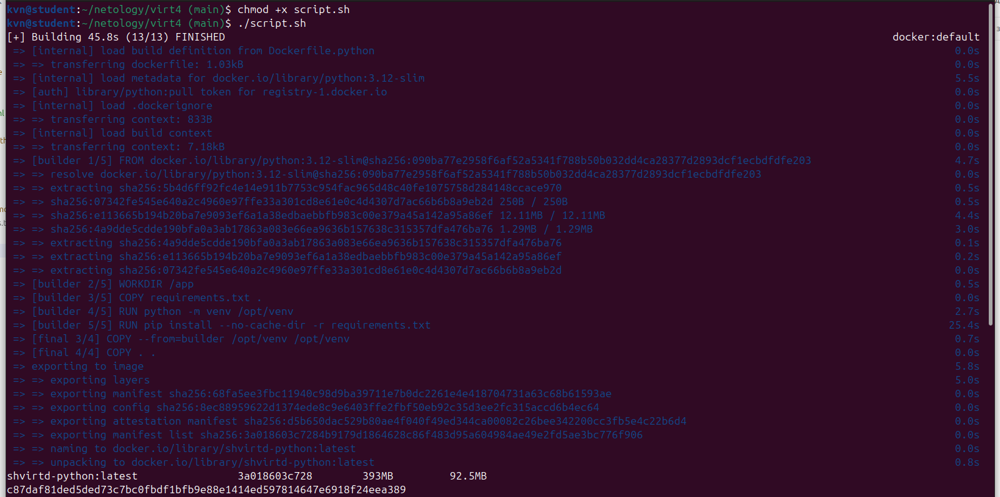  
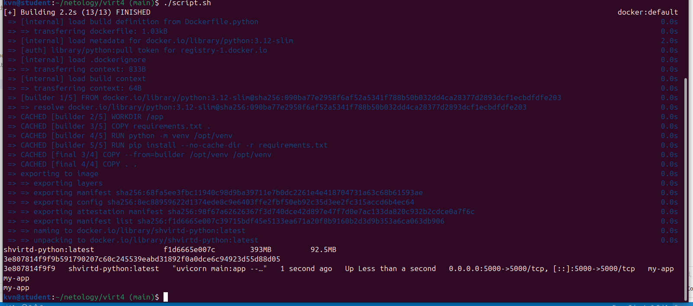  
  
  


---

## Задача 2 (*)
1. Создайте в yandex cloud container registry с именем "test" с помощью "yc tool" . [Инструкция](https://cloud.yandex.ru/ru/docs/container-registry/quickstart/?from=int-console-help)
2. Настройте аутентификацию вашего локального docker в yandex container registry.
3. Соберите и залейте в него образ с python приложением из задания №1.
4. Просканируйте образ на уязвимости.
5. В качестве ответа приложите отчет сканирования.

<span style="color:red"> 

## Ответ  
<span style="color:black">

1) Создаём каталогв Яндекс Облаке.  
2) Настриаиваем аутентификацию.  
3) Делаем push образа в новый каталог (registry). Убедимся, что образ попал в registry.  
4) Просканируем образ. Уязвимости найдены.  


Скриншоты.  

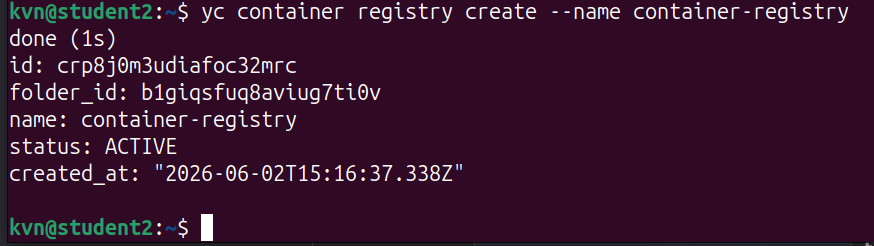  
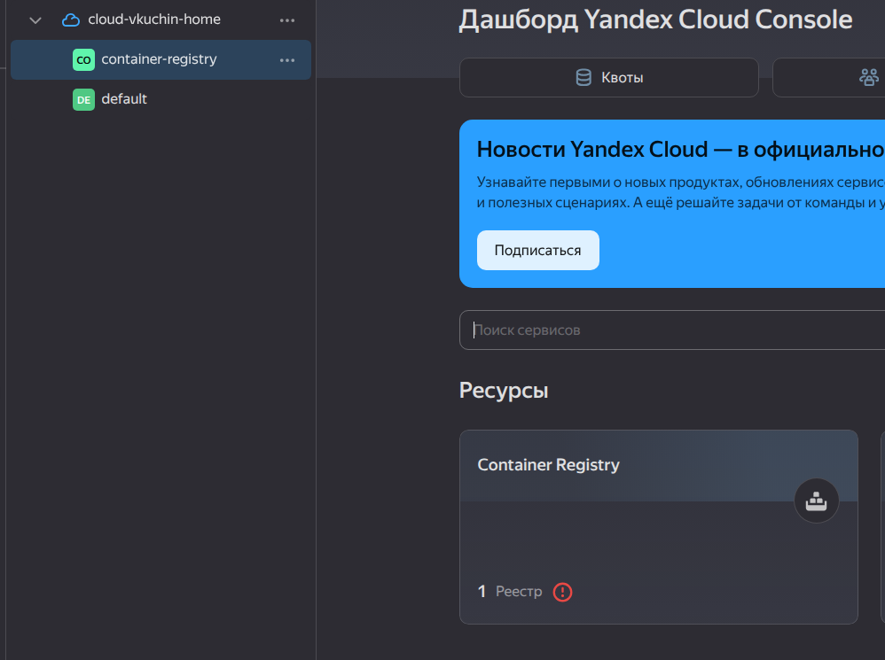  
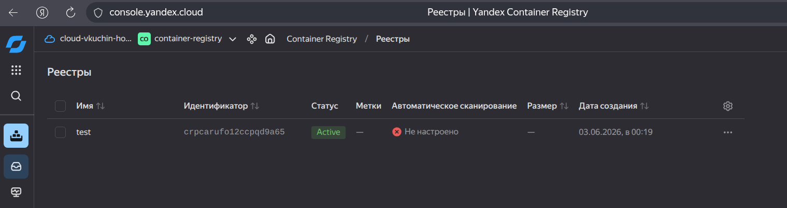  
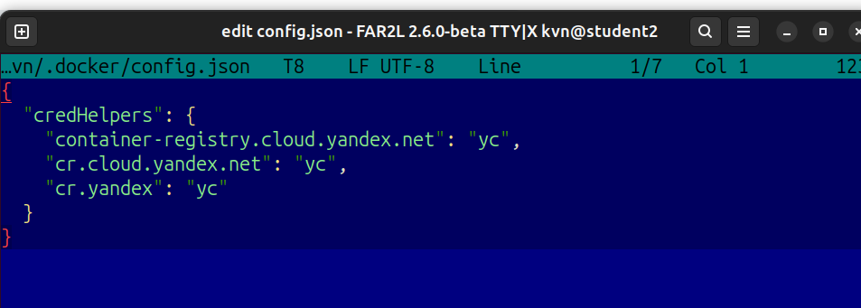  
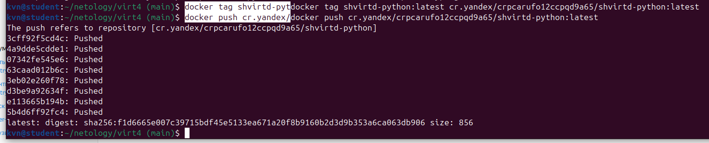  
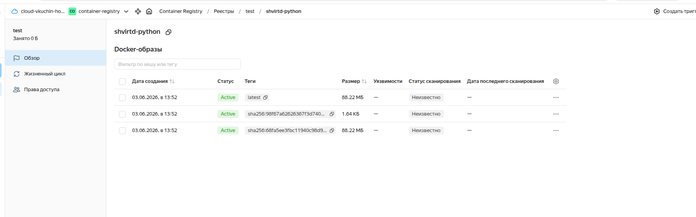  
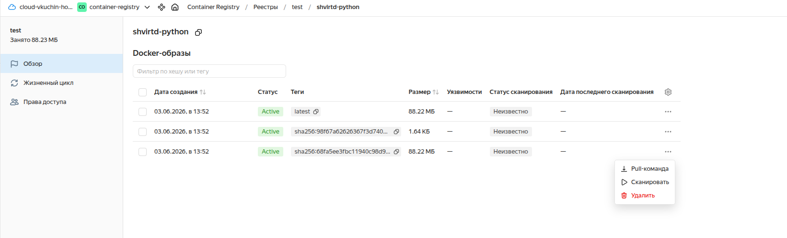  
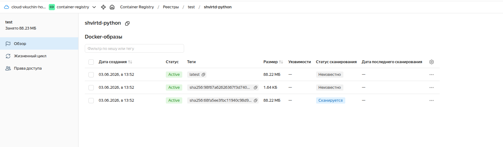  
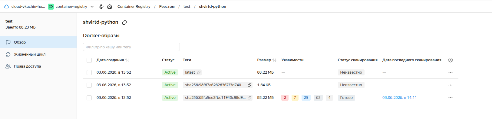  
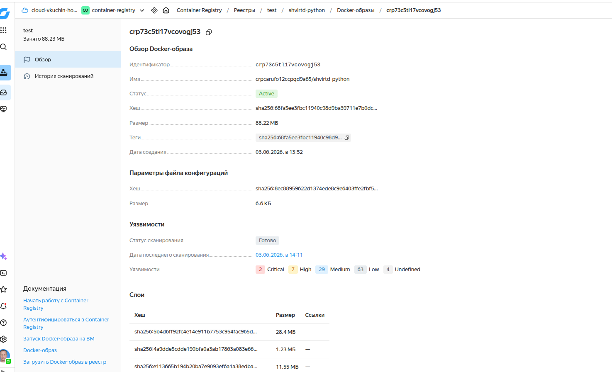  


---
## Задача 3
1. Изучите файл "proxy.yaml"
2. Создайте в репозитории с проектом файл ```compose.yaml```. С помощью директивы "include" подключите к нему файл "proxy.yaml".
3. Опишите в файле ```compose.yaml``` следующие сервисы: 

- ```web```. Образ приложения должен ИЛИ собираться при запуске compose из файла ```Dockerfile.python``` ИЛИ скачиваться из yandex cloud container registry(из задание №2 со *). Контейнер должен работать в bridge-сети с названием ```backend``` и иметь фиксированный ipv4-адрес ```172.20.0.5```. Сервис должен всегда перезапускаться в случае ошибок.
Передайте необходимые ENV-переменные для подключения к Mysql базе данных по сетевому имени сервиса ```web``` 

- ```db```. image=mysql:8. Контейнер должен работать в bridge-сети с названием ```backend``` и иметь фиксированный ipv4-адрес ```172.20.0.10```. Явно перезапуск сервиса в случае ошибок. Передайте необходимые ENV-переменные для создания: пароля root пользователя, создания базы данных, пользователя и пароля для web-приложения.Обязательно используйте уже существующий .env file для назначения секретных ENV-переменных!

2. Запустите проект локально с помощью docker compose , добейтесь его стабильной работы: команда ```curl -L http://127.0.0.1:8090``` должна возвращать в качестве ответа время и локальный IP-адрес. Если сервисы не стартуют воспользуйтесь командами: ```docker ps -a ``` и ```docker logs <container_name>``` . Если вместо IP-адреса вы получаете информационную ошибку --убедитесь, что вы шлете запрос на порт ```8090```, а не 5000.

5. Подключитесь к БД mysql с помощью команды ```docker exec -ti <имя_контейнера> mysql -uroot -p<пароль root-пользователя>```(обратите внимание что между ключем -u и логином root нет пробела. это важно!!! тоже самое с паролем) . Введите последовательно команды (не забываем в конце символ ; ): ```show databases; use <имя вашей базы данных(по-умолчанию virtd, как это указано в .env)>; show tables; SELECT * from requests LIMIT 10;```. Примечание: таблица в БД создается после первого поступившего запроса к приложению.

6. Остановите проект. В качестве ответа приложите скриншот sql-запроса.

<span style="color:red"> 

## Ответ  
<span style="color:black">

1) Изучаем файл "proxy.yaml". Это конфигурация Docker Compose для запуска двух прокси-серверов в контейнерах. Обратный прокси-сервер HAProxy, слушает порт 127.0.0.1:8080, Ingress-прокси на nginx с сетевым режимом host. Файл создаёт прокси-слой для маршрутизации трафика к приложениям (web и db). HAProxy и Nginx работают как обратные прокси, распределители нагрузки и терминаторы SSL.   
2) Файл compose.yaml создан ранее. С помощью директивы "include" подключаем к нему файл "proxy.yaml", чтобы все сервисы работали в одной сети backend.  
4) Описываем в файле compose.yaml следующие сервисы:  
**web**. Образ приложения будет собираться при запуске compose из файла Dockerfile.python. Контейнер будет работать в bridge-сети с названием backend и иметь фиксированный ipv4-адрес 172.20.0.5. Сервис будет всегда перезапускаться в случае ошибок. Передаём ENV-переменные для подключения к Mysql базе данных по сетевому имени сервиса web.    

**db**. image=mysql:8. Контейнер будет работать в bridge-сети с названием backend и иметь фиксированный ipv4-адрес 172.20.0.10. Настраиваем явно перезапуск сервиса в случае ошибок. Передаём ENV-переменные для создания: пароля root пользователя, создания базы данных, пользователя и пароля для web-приложения из существующего .env файлаe для назначения секретных ENV-переменных.  

5) Запускаем проект локально с помощью docker compose up -d. После освобождения портов и удаления ранее запущенных контейнеров получаем нормальный старт.  
Проверяем стабильную работу: командой docker ps -a **(контейнеры в статусе Up, запущены успешно)** и командой curl -L http://127.0.0.1:8090 **возвращает Ошибку 503 в качестве ответа**, тренируемся с пробросом порта в web. В итоге получаем время и локальный IP-адрес.  

6) Подключеамся к БД mysql с помощью команды docker exec -ti virt4-db-1 mysql -uroot -pYtReWq4321. Вводим последовательно команды: show databases; use <имя вашей базы данных(по-умолчанию virtd, как это указано в .env)>; show tables; SELECT * from requests LIMIT 10;. 

7) Останавливаем проект. 


Файлы.    
<a href="./compose.yaml" target="_blank"> compose.yaml </a>  


Скриншоты.  

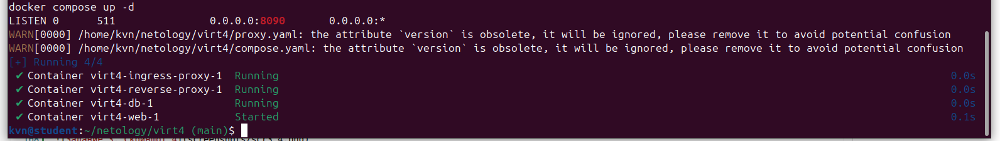  
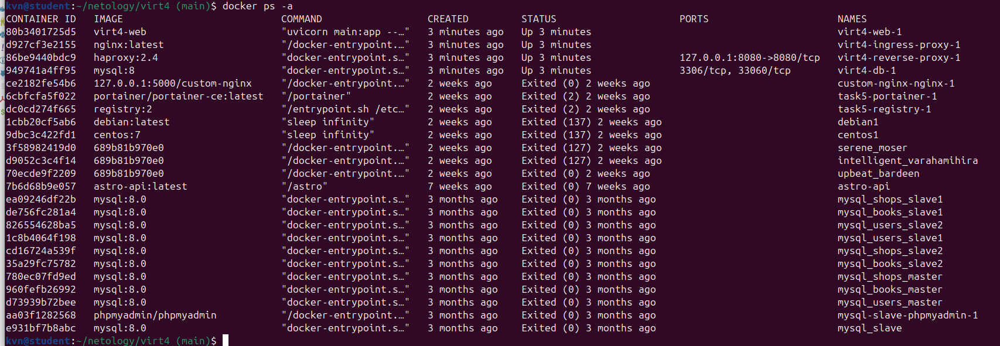  
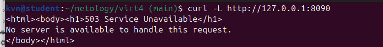  
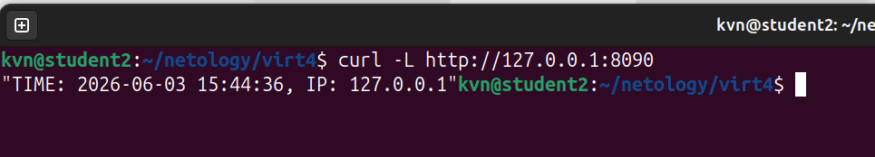  
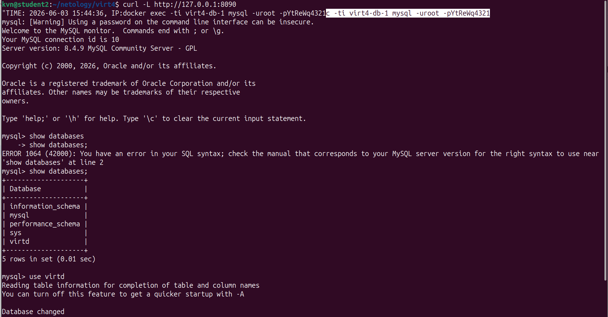  
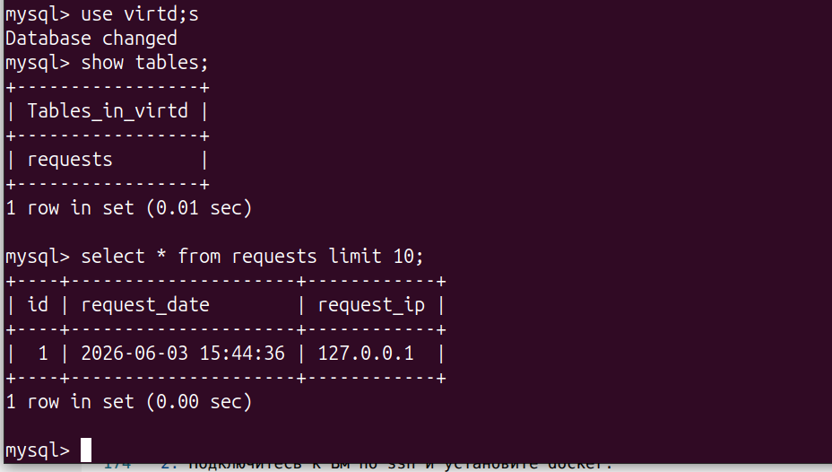  
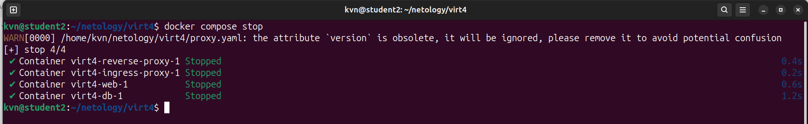  


## Задача 4
1. Запустите в Yandex Cloud ВМ (вам хватит 2 Гб Ram).
2. Подключитесь к Вм по ssh и установите docker.
3. Напишите bash-скрипт, который скачает ваш fork-репозиторий в каталог /opt и запустит проект целиком.
4. Зайдите на сайт проверки http подключений, например(или аналогичный): ```https://check-host.net/check-http``` и запустите проверку вашего сервиса ```http://<внешний_IP-адрес_вашей_ВМ>:8090```. Таким образом трафик будет направлен в ingress-proxy. Трафик должен пройти через цепочки: Пользователь → Internet → Nginx → HAProxy → FastAPI(запись в БД) → HAProxy → Nginx → Internet → Пользователь
5. (Необязательная часть) Дополнительно настройте remote ssh context к вашему серверу. Отобразите список контекстов и результат удаленного выполнения ```docker ps -a```
6. Повторите SQL-запрос на сервере и приложите скриншот и ссылку на fork.


<span style="color:red"> 

## Ответ  
<span style="color:black">

1) Будем разворачивать ВМ и устанавливать docker через terraform+ansible.Создаём каталог ./terraform и файлы в нём  

Файлы.    
<a href="./terraform/cloud-init.yml.tpl" target="_blank"> cloud-init.yml.tpl </a>  
<a href="./terraform/playbook1.yml" target="_blank"> playbook1.yml </a>  
<a href="./terraform/group_vars/all/vault.yml" target="_blank"> vault.yml </a>  
<a href="./terraform/main.tf" target="_blank"> main.tf </a>  
<a href="./terraform/network.tf" target="_blank"> network.tf </a>  
<a href="./terraform/providers.tf" target="_blank"> providers.tf </a>  
<a href="./terraform/variables.tf" target="_blank"> variables.tf </a>   
<a href="./terraform/deploy.sh" target="_blank"> deploy.sh </a>   (развернёт наш проект из репозитория на ВМ)  

 
 
2) Разворачиваем инфраструктуру. Terraform успешно отработал и сервер создалася в облаке.  
3) Проверим доступ к серверу через ssh. Ок.
4) Устанавлиаем docker через ansible playbook. Ok.  
5) Скрипт развернул контейнеры в ВМ и мы их видим.  
6) Проверяем с локальной машины работу проекта curl http://51.250.93.133:8090   Ок.
7) Создаём remote ssh context командой docker context create yc-remote --docker "host=ssh://yc-user@51.250.93.133"  
8) Посмотрим спиоск контекстов docker context ls .  
9) Активируем наш контекст docker context use yc-remote  
10) Выведем список контейнеров docker ps -a и убедимся по идентифкаторам что контейнерры оторазились те же что и на ВМ.  
11) Зайдём по на сервер по ssh, подключимся к контейнеру БД и запросим содержимое таблицы requests командой docker exec -it virt4-db-1 mysql -u app -pQwErTy1234 virtd -e "SELECT * FROM requests ORDER BY id DESC LIMIT 10;".    
12) Ссылка на форк <a href="https://github.com/x-optima/virt4.git"> repo_url </a>   


Скриншоты.  

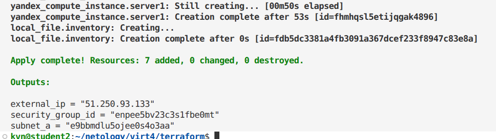  
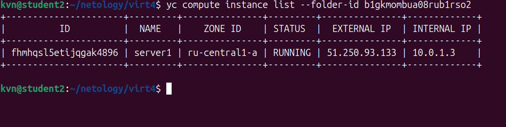  
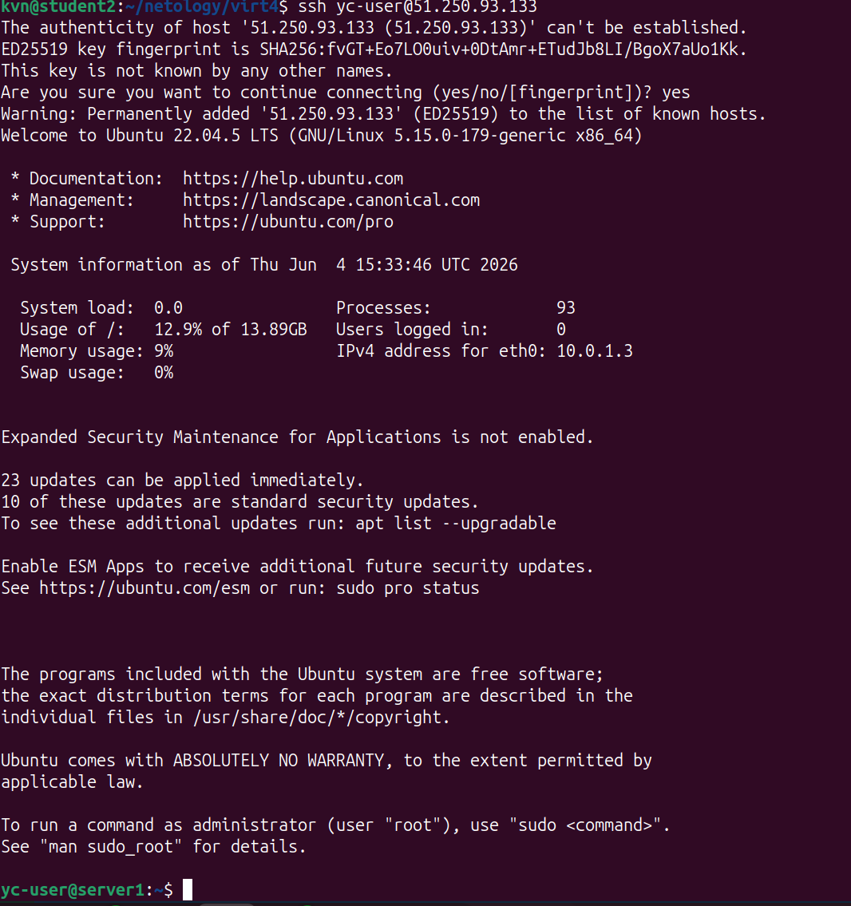  
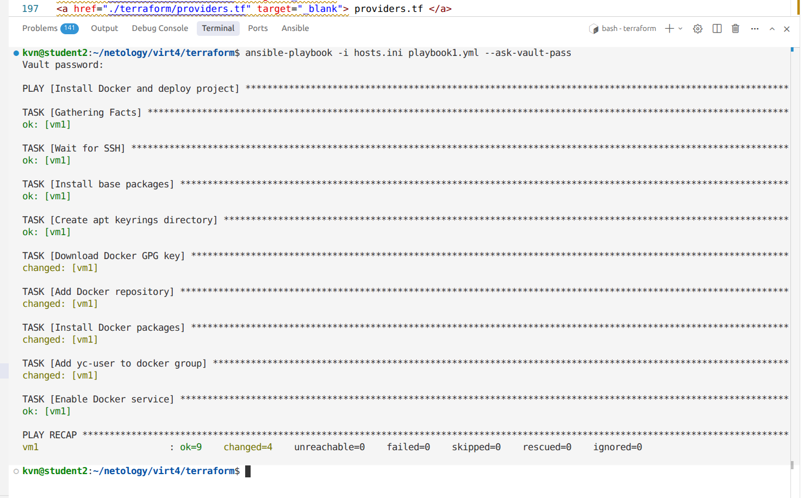  
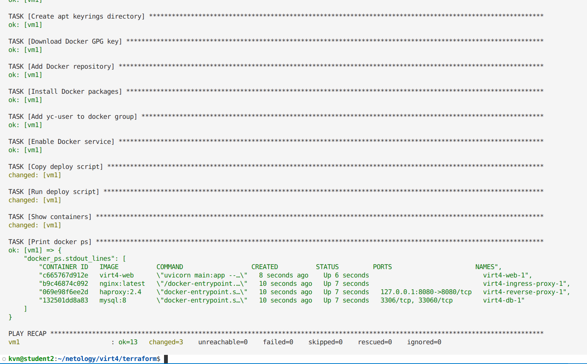  
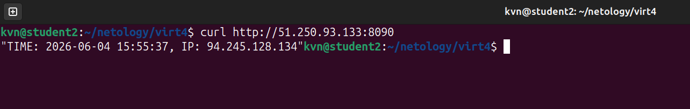  
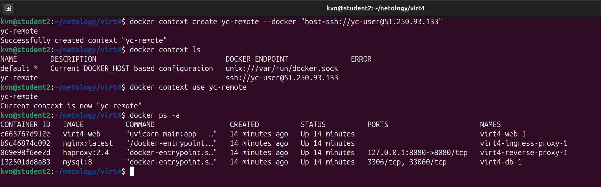  
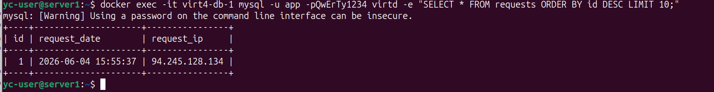  
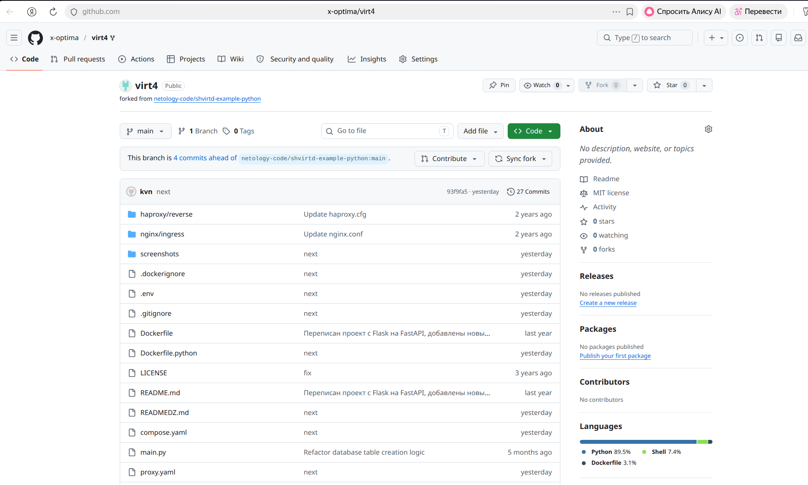  


## Задача 5 (*)
1. Напишите и задеплойте на вашу облачную ВМ bash скрипт, который произведет резервное копирование БД mysql в директорию "/opt/backup" с помощью запуска в сети "backend" контейнера из образа ```schnitzler/mysqldump``` при помощи ```docker run ...``` команды. Подсказка: "документация образа."
2. Протестируйте ручной запуск
3. Настройте выполнение скрипта раз в 1 минуту через cron, crontab или systemctl timer. Придумайте способ не светить логин/пароль в git!!
4. Предоставьте скрипт, cron-task и скриншот с несколькими резервными копиями в "/opt/backup"

<span style="color:red"> 

## Ответ  
<span style="color:black">

1) Будем делать через ansible playbook.Для этого создадим файлы  

<a href="./terraform/playbook_backup.yml" target="_blank"> playbook_backup.yml </a>
<a href="./terraform/mysql-backup.sh.j2" target="_blank"> mysql-backup.sh.j2 </a>
<a href="./terraform/backup.env.j2" target="_blank"> backup.env.j2 </a>

2) Опишем плейбук и шаблоны.
3) Добавим пароль пользователя в vault.yml . ansible-vault edit group_vars/all/vault.yml "vault_mysql_password: "QwErTy1234""  
4) Запустим плейбук. Плейбук не запускается из-за того, что используется старый клиент mysqldump внутри образа schnitzler/mysqldump, а сервер БД развёрнут как MySQL 8.4 (через образ mysql:8), где по умолчанию включён плагин аутентификации caching_sha2_password, который этот клиент не поддерживает. 
5) Меняем в compose.yaml в секции db версию образа на 8.0, удаляем работающие контейнеры и пересобираем начиная с playbook1.yml.  
6) 

Скриншоты.  
 
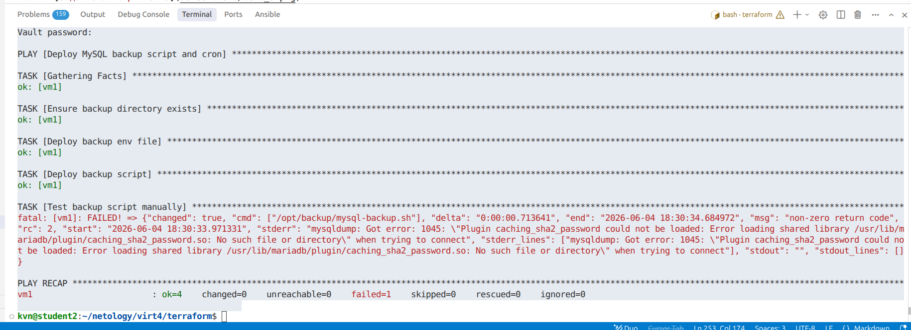  
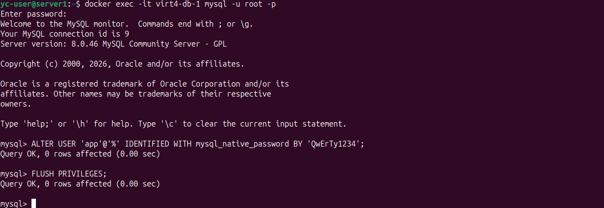  
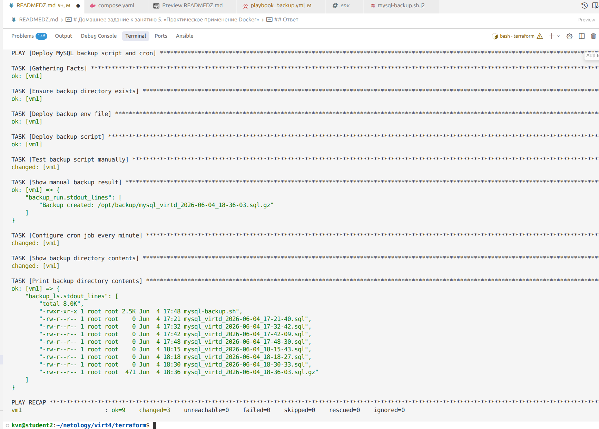
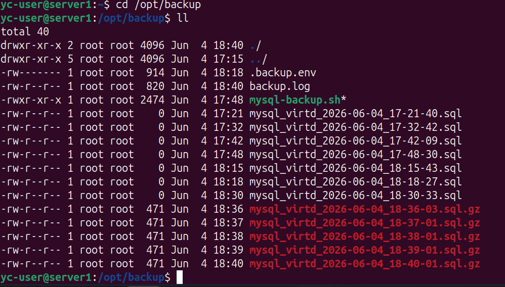  
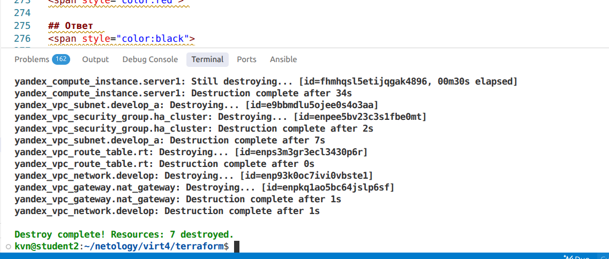  

  
  


## Задача 6
Скачайте docker образ ```hashicorp/terraform:latest``` и скопируйте бинарный файл ```/bin/terraform``` на свою локальную машину, используя dive и docker save.
Предоставьте скриншоты  действий .

<span style="color:red"> 

## Ответ  
<span style="color:black">

Скриншоты.  

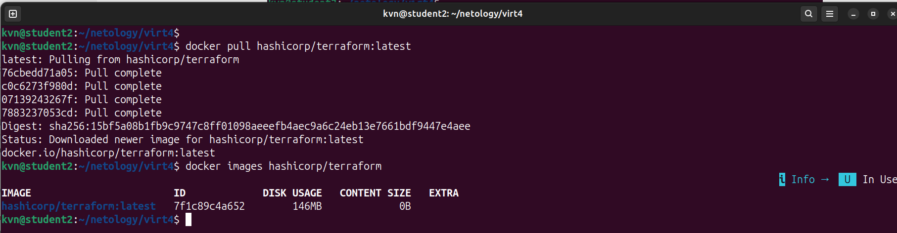  
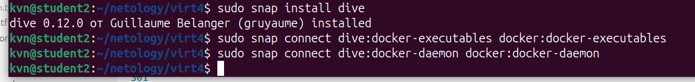  
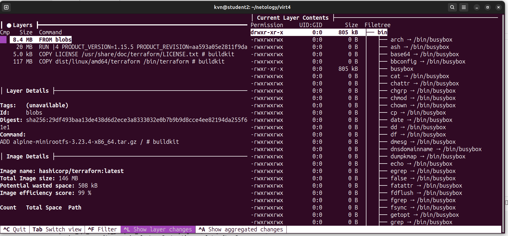  


## Задача 6.1
Добейтесь аналогичного результата, используя docker cp.  
Предоставьте скриншоты  действий .


<span style="color:red"> 

## Ответ  
<span style="color:black">

Скриншоты.  

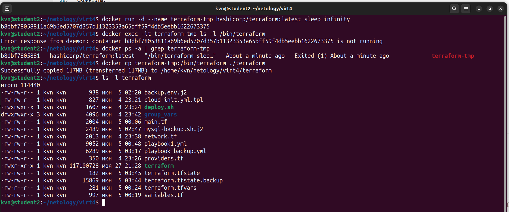  
  